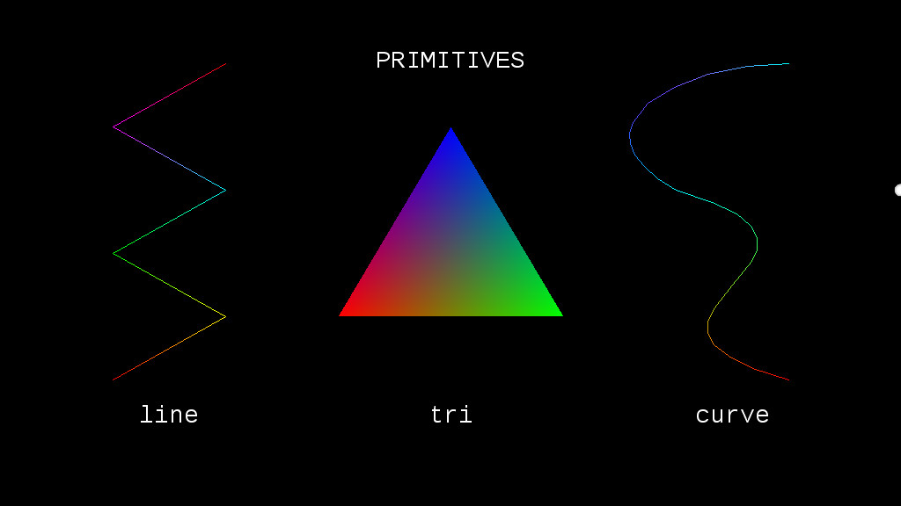
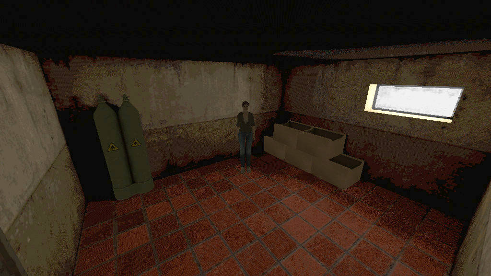

[](https://ci.appveyor.com/project/MrApfel1994/sw)
# SW
Simple software rasterizer with OpenGL-like interface.
It's neither fast nor good, created for learning purposes.
Inspired by this article: https://web.archive.org/web/20180129085015/http://forum.devmaster.net/t/advanced-rasterization/6145

- Full Application: https://bitbucket.org/Apfel1994/swdemo

||
:-------------------------:|:-------------------------:|:-------------------------:

### Drawing

```cpp
swUseProgram(program);

swBindBuffer(SW_ARRAY_BUFFER, attribs_buf_id);
swBindBuffer(SW_INDEX_BUFFER, indices_buf_id);

swSetUniform(U_MVP, SW_MAT4, &mvp_mat[0][0]);

const int stride = sizeof(float) * 8;
swVertexAttribPointer(A_POS, 3 * sizeof(float), (SWuint)stride, (void *)0);
swVertexAttribPointer(A_UVS, 2 * sizeof(float), (SWuint)stride, (void *)(6 * sizeof(float)));

swDrawElements(SW_TRIANGLE_STRIP, (SWuint)num_indices, SW_UNSIGNED_SHORT, (void *)uintptr_t(offset));
```

### Shaders (not really, just function pointers)

```cpp
enum { A_POS,
       A_UVS };

enum { V_UVS };

enum { U_MVP,
       U_AMBIENT };

VSHADER environment_vs(VS_IN, VS_OUT) {
    using namespace glm;

    *(vec2 *)V_FVARYING(V_UVS) = make_vec2(V_FATTR(A_UVS));
    *(vec4 *)V_POS_OUT = make_mat4(F_UNIFORM(U_MVP)) * vec4(make_vec3(V_FATTR(A_POS)), 1);
}

FSHADER environment_fs(FS_IN, FS_OUT) {
    using namespace glm;

    const vec4 &fl = make_vec4(F_UNIFORM(U_FLASHLIGHT_POS));

    TEXTURE(DIFFUSEMAP_SLOT, F_FVARYING_IN(V_UVS), F_COL_OUT);
    *(vec3 *) F_COL_OUT *= make_vec3(F_UNIFORM(U_AMBIENT));
}

...

SWint program = swCreateProgram();
swUseProgram(p);
swInitProgram(environment_vs, environment_fs, 2);

swRegisterUniformv(U_MVP, SW_MAT4, 1);
swRegisterUniformv(U_AMBIENT, SW_VEC3, 1);
```

